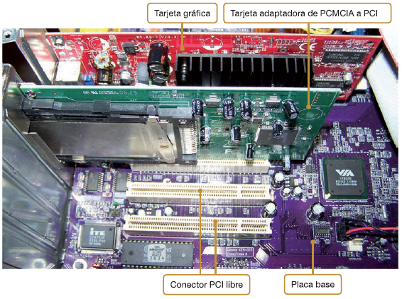
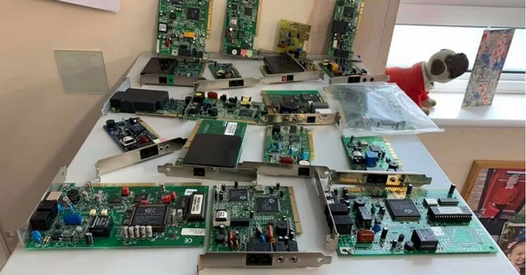

<link rel="stylesheet" type="text/css" href="css/estilos.css"/>
<!--  -->

# Introducción

Las tarjetas de expansión se insertan en las ranuras de expansión y permiten  mejorar y añadir nuevas funciones al equipo. Su misión es comunicar dispositivos periféricos internos como externos con el sistema de bus del ordenador. 

Principalmente son **VESA, PCI**, **AGP** (todas estas prácticamente obsoletas) y **PCI Express**, y se instalan en el **slot** correspondiente.

Una vez insertadas en el ordenador, será necesaria su configuración en el sistema operativo mediante controladores o ***drivers*** y la instalación del software del fabricante. También existen tarjetas ***plug-and-play***, que se configuran automáticamente con ayuda del sistema operativo.  

Tarjetas de expansión más comunes:

*   Tarjeta gráfica.
*   Tarjeta de red: LAN o Wi-Fi.
*   Tarjetas multimedia: sonido, captura de vídeo, captura de televisión, etc.

Además, es posible ampliar nuestro equipo con otras tarjetas como:  

*   Tarjetas de módem.
*   Tarjetas de puertos USB.
*   Tarjetas de puertos en serie o paralelo.
*   Tarjetas controladoras de discos.
*   Otras tarjetas adaptadoras; firewire, entradas/salidas, especificas de dispositivos, etc...

Debido al avance en la tecnología _**USB**_ y a la _**integración de audio/vídeo en la placa base**_, hoy en día las tarjetas de expansión se emplean cada vez con menos frecuencia, integrándose en estos dispositivos todas las funcionalidades de las tarjetas de expansión convencionales.

{width=70%}

Ejemplos de tarjetas:

{width=70%}

<!-- 

\begin{figure}[h]{0.45\textwidth} 
  \centering
  \includegraphics[width=\textwidth]{imgs/tarjeta-expansion-ordenador.png}
  \caption{Unos gatos molones}
  \label{fig:gatos}
\end{figure}

\begin{figure}
\includegraphics[width=6cm,angle=30]{./imgs/Markdown.png}
\caption{Logo de Markdown}
\end{figure}

Ahora hacemos el salto de página

\newpage

Una vez hecho el salto de página
We include an image in the next paragraph:

{width=50%}
{ width=30% } -->

::: note
Anotació: Apuntes preparados para el curso de MarkDown.
:::

<!-- 
::: tip
Consell: Lorem ipsum dolor sit amet, consectetur adipiscing elit. Mauris pellentesque justo sit amet urna aliquam, dictum egestas felis dapibus.
:::

::: warning
Avís: Si poses `string` en compte de `String` en donarà molts **problemes**. Lorem ipsum dolor sit amet, consectetur adipiscing elit. Mauris pellentesque justo sit amet urna aliquam, dictum egestas felis dapibus.
:::

::: caution
Precaució: Lorem ipsum dolor sit amet, consectetur adipiscing elit. Mauris pellentesque justo sit amet urna aliquam, dictum egestas felis dapibus.
:::

::: important
Important: Lorem ipsum dolor sit amet, consectetur adipiscing elit. Mauris pellentesque justo sit amet urna aliquam, dictum egestas felis dapibus.
::: -->