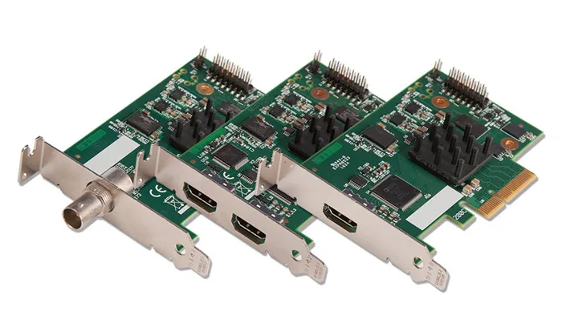

<link rel="stylesheet" type="text/css" href="css/estilos.css"/>

# Tarjetas capturadoras de vídeo

- [Tarjetas capturadoras de vídeo](#tarjetas-capturadoras-de-vídeo){width=60%}

Este tipo de tarjetas, cuando se conectan de manera interna en un PC, también se consideran tarjetas de expansión. Dado que se conectan a través de un puerto PCIe (o PCI, en el caso de las más antiguas).  

Gracias a ellas, muchos de nosotros hemos podido ver la televisión directamente en nuestro ordenador. Sin embargo, para ese tipo de uso, hace tiempo que ya no se utilizan. No al menos como antiguamente.  

{width=50%}

Pero las tarjetas que se utilizan para hacer streaming y grabar partidas, son la nueva moda entre los usuarios gamers.

Existen capturadoras te permiten **grabar vídeo en 4K a 60 FPS** en tu ordenador del mismo o de otras consolas. La mayoría de capturadoras cuentan con un software que nos permite editar fácilmente lo que queremos subir posteriormente en YouTube y que tiende a ser muy sencillo de usar. En este caso no hemos podido hacer una amplia lista de capturadoras, ya que el mercado actual de capturadoras 4K no está muy poblado.

Enlace: [Las mejores capturadoras 4K del mercado que podemos encontrar en Amazon](https://hardzone.es/2018/08/26/mejores-capturadoras-4k-60-fps/)